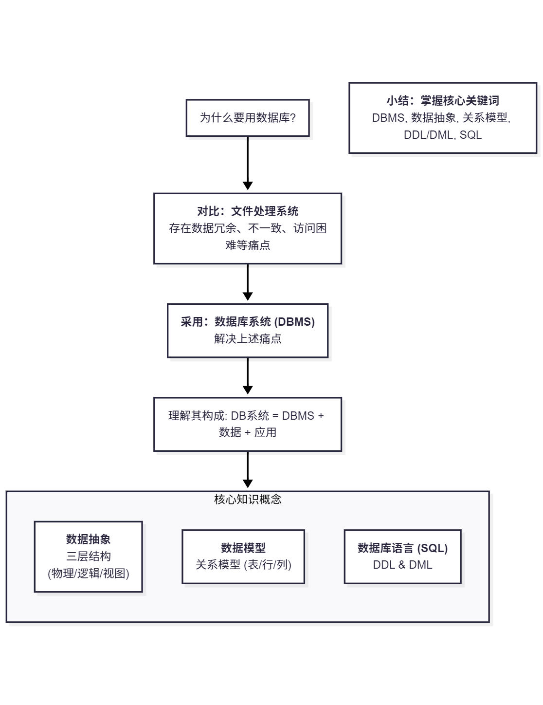
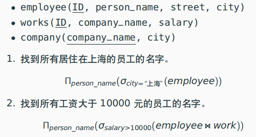
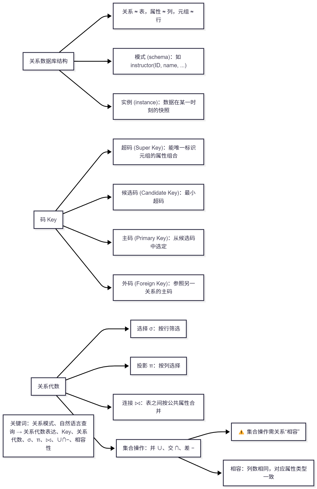
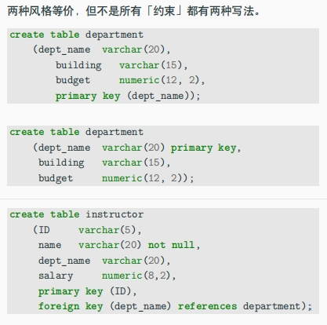
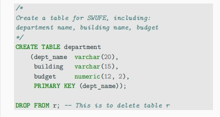
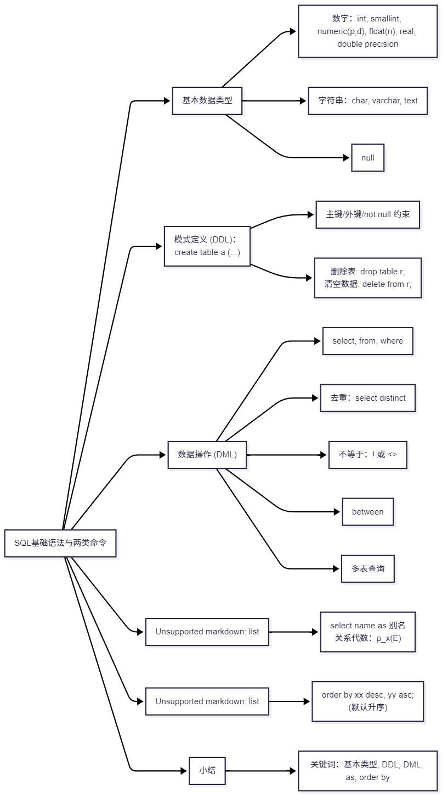
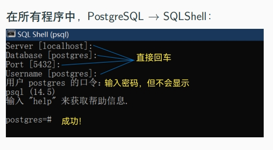
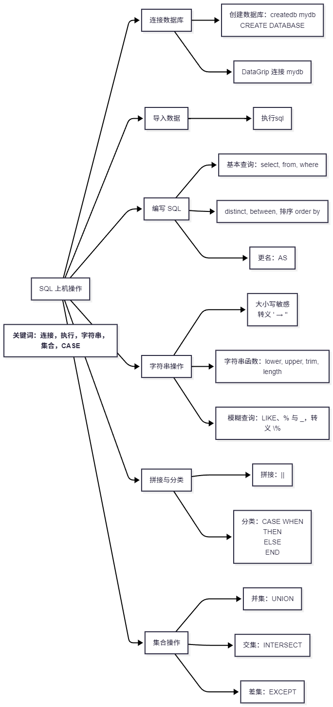
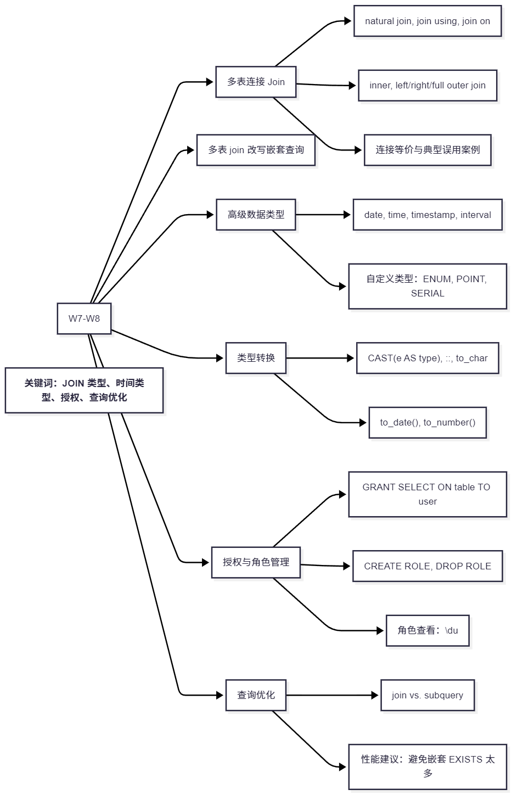

# DB-SWUFE
[Homework](homework) & Project & [Self-Evaluation](#自我评价)

- [intro](#w1-intro)
- [关系模型](#w2-relational-model)
- [基础sql](#w3-sql)
- [基础sql操作](#w4-上机)
- [聚合查询&增删改](#w5+6-聚合查询与增删改)
- [JOIN与查询优化](#w7+8-多表JOIN与查询优化)
- [函数与过程、数据库设计](#w9+10-函数与过程&数据库设计)
- [Python连接数据库](#w11-Python连接数据库与操作)
- [ER&NF](#w12+13-ER模型&函数依赖与范式分解)
- [theory](#w14_16-存储&索引与事务)
- [期末设计](#w14_16-期末设计)

## w1-intro

本周内容以宏观概念为主，通过老师的讲解和资料阅读，对数据库有了初步认识。

### 本周学习

建立对数据库的整体认知。

1. 数据可系统（数据库）
   - DBMS：数据管理系统
   - 数据及关联应用

2. 知识概念：
    - 数据抽象：学习了数据库系统的三层抽象结构（物理层、逻辑层、视图层），理解了“抽象”这一计算机科学核心思想如何帮助我们屏蔽底层复杂性。
    - 数据模型：关系模型（Relational Model）、实体-联系模型（E-R Model）、半结构化模型等。最常用的**关系模型**，即“表(table)”就是“关系(relation)”，由行（row/tuple）和列（column/attribute）构成。
    - SQL作为声明式语言（关注What，而非How）的两大组成部分：
      - **DDL（数据定义语言）**用于定义模式（`CREATE TABLE`）
      - **DML（数据操纵语言）**用于查询和更新（`SELECT`, `INSERT`）。
3. 为什么要用数据库？
   相比文件处理系统，DBMS的优越性在于解决了文件系统普遍存在的**数据冗余与不一致、数据隔离、访问困难、完整性、安全性和并发访问异常**等痛点。
   
### 实践

1. 环境搭建：遵循课程指引，成功在本地安装了ostgreSQL和DataGrip。
2. 挑战题：完成了 [第一周挑战题](https://github.com/YH324/DB-SWUFE-2025/blob/main/challenge/challenge-20250309.md)。主要是深化对DB的认识和熟悉LLM的API调用操作，对实际应用很有帮助。

### 小结

**关键词**：**数据库 (Database), DBMS**, 文件系统 vs. 数据库系统, 数据冗余与不一致, **数据抽象** (三层模型), 关系模型 (表/行/列), **DDL/DML**, SQL (声明式语言)



---

## w2-relational model

本周的学习深入到了抽象的**关系代数**，虽然完成了作业，但在初见关系代数时，确实感到了理论的挑战性，尤其是在并、交、差等集合运算上花费了较多时间才理清思路。

### 本周学习

1. 关系数据库
   - 结构：关系-表，属性-列，元组-行
   - 数据库模式-逻辑设计，数据库实例-数据快照
   - schema：含有关系名称和对应的属性集称为**该关系的模式**
      - instructor(ID, name, dept_name, salary) 
   
2.  码 (Key)/键：
    - 需要一个明确的标识符来区分每一条记录/元组。
    - 不同的码：
        - 超码 (Super Key)：能唯一标识元组的任意属性组合
        - 候选码 (Candidate Key)：**最小的超码**，真子集不可构成超码的超码
        - 主码 (Primary Key)：候选码中，由设计者选定的那一个
        - 外码 (Foreign Key)：是表与表之间建立连接的桥梁，它参照另一个表的主码，确保了数据的一致性

3.  关系代数：
    - DBMS在执行SQL查询时，会先将其翻译成关系代数的表示，再进行优化，理解它就是理解查询的本质。
    - 核心操作：
        - 选择行：$\sigma$，按行（水平）筛选出符合条件的元组
        - 选择列：$\pi$，按列（垂直）切出我们需要的属性
        - 连接 (Join, ⨝)：多表查询的核心，最常用的是自然连接，它能智能地将多个关系/表通过共同属性拼接起来
        - 并 (∪)、交 (∩)、差 (-)：对两个**相容**的表进行集合运算 （什么算相容？**关系的目相同，列名可以不同但实际含义相同，对应属性的类型相同**），还要巩固一下
     - 

### 实践

完成了本周的 [Homework 1](homework/DBhomework01.md)。作业内容主要是将自然语言描述的查询需求，翻译成关系代数表达式。

### 小结

**关键词**：关系模式, 码, 关系代数



---

## w3-sql

学习了sql的基本语法和两类命令（DDL DML）

### 本周学习
1. 基本数据类型
   - 数字：int，smallint，**numeric(p,d)：最多p位，小数点后d位 PG中等价于`decimal`**，float(n)**1-24real，25-53 double precision**，real，double precision
   - 字符串：char（定长），varchar（可变长），text（任意长）
   - null
2. 模式定义
   
   - 约束：pk fk not null
   - 删除：
     ```sql
     -- 删除表
     drop table r;
     -- 清空数据，保留表
     delete from r; 
     ```
   

3. DML
   - 基本结构：select, from, where
      - 去除重复
        ```sql
        select distinct dept_name from instructor;
        ```
   - **字符串使用单引号！**
   - 不等于：! <>
   - between、行构造：
     ```sql
     select name from instructor
     where salary between 9000 and 10000;

     select course from section
     where (semester,year) = ('spring', 2018);
     ```
   - 多表查询

4. 更名
   - select dept_name as a;select name from instructor as T
   - 关系代数：$\rho_x(E)$，将E更名为x

5. 排序
   - order by xx desc, yy asc
   - 默认升序

### 实践

完成了本周的 [Homework 2](homework/DBhomework02.md)。

### 小结

**关键词**：基本类型（数，字符串）, DDL（create table） & DML（select，from，from）, 更名运算（as）, 排序字句（order by）


---

# w4 上机

重点学习：

- 连接数据库 & 执行 SQL
- 字符串操作
- SQL 集合操作（并、交、差）

### 本周学习

1. 连接数据库
   - PostgreSQL 环境：使用 Postgres.app 或 psql
   - 创建数据库：
     ```
     
     ```bash
     CREATE DATABASE mydb;
     ```
   - 使用 DataGrip 连接数据库，Test Connection 成功后开始执行 SQL 文件（DDL.sql）

2. 导入数据（上机操作）
   - 执行语句文件：`DDL.sql`, `smallRelationsInsertFile.sql`
   - 设置数据源为 `mydb.public`

3. SQL 编写与执行
   - 建立Query Console
   - SELECT 语句练习：`distinct`, `between`, `where`, `and/or`, 多表查询
   - 更名操作：`AS`
   - 排序：`ORDER BY name DESC`

4. **字符串操作**
   - 字符串区分大小写
   - 如果字符串里有单引号，则double：`I''m good`；如果有双引号，不变
   - pg区分字符串大小写
   - boolean有三种状态
   - 常用字符串函数：
     ```sql
     SELECT lower('CHINA'), upper('good');
     SELECT trim(' SWUFE ');
     SELECT dept_name, length(dept_name) FROM department;
     ```
   - 模糊查询：
     - `%` 任意长度字符串，`_` 任意单字符
     - `LIKE`, `NOT LIKE`
     - 转义 `%`：`LIKE 'abc\%d%'`

5. **拼接与 CASE 表达式**
   - 拼接符号：`||`
     ```sql
     SELECT name || ' from ' || dept_name FROM student WHERE tot_cred > 50;
     ```
   - `CASE` 多分支分类：
     ```sql
     SELECT id,
       CASE
         WHEN score < 60 THEN 'C'
         WHEN score >= 80 THEN 'A'
         ELSE 'B'
       END
     FROM marks;
     ```

6. **集合操作**
   - `UNION`：并
   - `INTERSECT`：交
   - `EXCEPT`：差（MySQL不支持）

### 实践

完成了本周的 [Homework 3](homework/DBhomework03.md)，涵盖了一些上机操作和模糊查询。

### 小结

关键词：**连接数据库**、SQL 文件执行、字符串函数、**模糊匹配**、拼接符、集合操作（UNION/INTERSECT/EXCEPT）、CASE 分类语句


---

## w5+6-聚合查询与增删改

### 学习

1. null 值处理
   - null 表示“缺失值”，具有**反直觉特性**
     - `1 + null → null`、`1 > null → unknown`
   - 布尔三值逻辑：`true / false / unknown(null)`
   - 不能用 `=` 或 `<>` 比较 null，需使用：
     ```sql
     salary IS NULL / IS NOT NULL
     ```
   - `distinct` 视多个 null 为相等
   - order by 可能会把null排前面

2. coalesce 与 CASE 替代
   - `coalesce(x, y)`：若 x 为 null，返回 y
   - 等价 CASE：
     ```sql
     CASE WHEN salary IS NULL THEN 0 ELSE salary END
     ```

3. 聚集函数
   - 常用：`avg`, `sum`, `count`, `min`, `max`
   - 忽略 null（除 `count(*)` 会统计 null）
     ```sql
     SELECT count(*), count(salary) FROM instructor;
     ```
     **仅count能与\* 连用，仅count(\* )考虑null**
   - 聚集不能直接出现在where，因为谓词字句比聚集先生效
4. 分组聚集
   - 使用 `GROUP BY` 进行分组统计：
     ```sql
     SELECT dept_name, avg(salary) 
     FROM instructor 
     GROUP BY dept_name;
     ```
   - `HAVING` 作用于聚集后的分组，用于限制分组：
     ```sql
     HAVING avg(salary) > 50000
     ```
   - **出现在select但没有被聚集的属性必须出现在group by**

5. 嵌套子查询
   - 可嵌套于 `from`, `where`, `select`
   - `with` 语句定义临时关系
   - **标量子查询**：返回单值，用作比较条件
     ```sql
     SELECT name FROM instructor
     WHERE salary > (SELECT min(salary) FROM instructor);
     ```

6. 集合操作与比较
   - IN / NOT IN：成员资格判断
   - > SOME / > ALL：
     - `> SOME (...)` 相当于比其中**至少一个大**
     - `> ALL (...)` 比所有都大
   - `= SOME` ≈ `IN`，`<> ALL` ≈ `NOT IN`
   - any等价some

7. 空关系测试（EXISTS）
```sql
SELECT ... WHERE EXISTS (SELECT 1 FROM xxx);
```
用于判断子查询是否非空，比 `IN` 更高效

8. SQL 修改数据库（w6 重点）
- 删
  ```sql
  DELETE FROM instructor WHERE salary > 80000;
  -- 区别drop 和delete
  ```
- 增
  ```sql
  --指定，可以不指定但要按顺序
  INSERT INTO course(course_id, title) VALUES (...);
  INSERT INTO instructor SELECT ... FROM student;
  ```
- 改
  ```sql
  UPDATE instructor SET salary = salary * 1.05;
  ```
- 批量插入导入：使用 `COPY` 更快

9. DDL 扩展：修改关系
- 添加字段：
  ```sql
  ALTER TABLE student ADD COLUMN nationality text;
  ```
- 删除字段（ALTER TABLE student DROP COLUMN nationality）、修改数据类型、字段重命名
  
- 添加约束：
  - `UNIQUE`, `CHECK`, `DEFAULT`
  - `ALTER TABLE ... ADD CONSTRAINT ...`

10. SQL 排名（RANK）
- 使用窗口函数：
  ```sql
  RANK() OVER (ORDER BY salary DESC)
  ```
**select 字句的alias（重命名）不能用于where**

### 实践
完成了 [Homework 4](homework/DBhomework04.md)

### 小结

关键词：**`null`**、三值逻辑、`coalesce`、**聚集函数**、分组聚集、`having`、**嵌套子查询**、`> some`、`exists`、`insert/delete/update`、`alter table`、约束、rank 排名


---

## w7+8-多表JOIN与查询优化

> 从这里开始有很多需要巩固的知识点
 
### 学习

1. **多表 JOIN 查询（连接类型与语义）**
   - 等值连接 vs. 自然连接：
     ```sql
     SELECT name, course_id
     FROM student JOIN takes ON student.id = takes.id;
   
     -- 等价于自然连接（natural join）
     SELECT name, course_id
     FROM student NATURAL JOIN takes;
     ```
     > natural join 会自动匹配所有同名属性！需警惕隐含错误。
   
   - 常见写法
     - 使用 `ON` 指定任意连接条件
     - 使用 `USING(attr)` 指定连接属性（避免属性重复）
     - SQL 默认 `JOIN` 是 `INNER JOIN`
   
   - 连接类型
     - `INNER JOIN`: 满足条件的元组配对
     - `LEFT/RIGHT OUTER JOIN`: 保留左/右表未匹配元组，用 `NULL` 补全
     - `FULL OUTER JOIN`: 所有元组均保留，未匹配部分填 NULL

2. 例题学习
   - 找出讲课数为 0 的老师：
     ```sql
     SELECT ID, count(sec_id)
     FROM instructor NATURAL LEFT JOIN teaches
     GROUP BY ID;
     ```
   
   - 课程选课人数统计（包含 0 人课程段）：
     ```sql
     SELECT course_id, sec_id, count(id)
     FROM section NATURAL LEFT JOIN takes
     WHERE semester = 'Fall' AND year = 2017
     GROUP BY course_id, sec_id;
     ```
   - 多表嵌套重写：
     使用 `with` 语句命名临时表，提升可读性和性能
     
3. 高级数据类型
   - 日期与时间：
     - `date`, `time`, `timestamp`
     - 时间差类型：`interval`
     ```sql
     SELECT current_timestamp, current_date;
     SELECT timestamp '2023-12-25 13:14:15';
     ```
   **PG的数据类型更丰富！**
   - 自定义类型：
     - `ENUM`：如健康码颜色 `('red', 'yellow', 'green')`
     - `point`：几何坐标
     - `serial`：自增主键

 4. 类型转换与格式化
   - 标准语法：
     ```sql
     SELECT CAST('2025-06-01' AS date);
     -- PG独有的数据类型转换符号
     SELECT '3.14'::decimal;
     ```
   - 格式化：
     ```sql
     SELECT to_char(42, '00999');  -- 输出 00042
     SELECT to_date('08-07 2022', 'MM-DD YYYY');
     ```
     
5. 授权机制
   - `GRANT` 授权特定角色：
     ```sql
     GRANT SELECT, INSERT ON department TO lilei;
     ```
   - PG角色统一采用 `ROLE` 管理
   - 管理命令：
     ```sql
     \du             -- 查看所有角色
     CREATE ROLE hanmeimei;
     DROP ROLE lilei;
     ```
   - 使用 pg_dump 进行数据库备份

### 小结

关键词：**inner/outer join, natural join**, using/on, **时间/日期类型**, enum/point, cast/to_char, grant/role, exists/in vs. join, 查询优化



---

## w9+10-函数与过程&数据库设计

### W9：函数与过程、动态 SQL 与 SQL 注入

1. 函数 & 过程基础
   - 函数：返回值，有输入输出
     ```sql
     CREATE FUNCTION add(i integer, j integer)
     RETURNS integer AS $$ SELECT i + j; $$ LANGUAGE SQL;
     ```
   - 过程：执行操作，无返回值（一般用于更新/插入等）
     ```sql
     CREATE PROCEDURE add2(integer, integer) AS $$ SELECT $1 + $2; $$ LANGUAGE SQL;
     ```
> 函数-计算，过程-执行

2. plpgsql
   - 可以写变量、控制结构等，比纯 SQL 强大
     ```sql
     CREATE FUNCTION deptCount(varchar)
     RETURNS integer AS $$
     DECLARE d_count integer;
     BEGIN
       SELECT count(*) INTO d_count FROM instructor WHERE dept_name = $1;
       RETURN d_count;
     END;
     $$ LANGUAGE plpgsql;
     ```

3. 动态 SQL 与程序访问
   - 编程语言可以访问 DB（典型架构：B/S 模式）
   - JDBC / ODBC / **psycopg2** 等驱动起桥梁作用
   - ORM 框架如 SQLAlchemy 统一不同 DBMS 语法
> w11上机使用了psycopg2，感觉很方便

4. SQL注入
   - 拼接 SQL 语句易遭攻击，比如：
     ```sql
     name = "zhongpu"
     pswd = "' or '1'='1"
     ```
     导致：
     ```sql
     SELECT * FROM users WHERE name='zhongpu' AND pswd='' or '1'='1';
     ```
> 所以写 web 登录功能时别直接拼接 SQL

### W10：数据库设计, ER 模型与关系模式转化

1. 数据库设计流程
   - 需求分析 → 概念设计（ER）→ 逻辑设计（schema）→ 物理设计
   - 先画图，再设计

2. ER 模型
   - 实体集：有属性，有主码
   - 联系集：描述实体之间的关系
   - 属性可细分为：
     - 简单 / 复合
     - 单值 / 多值
     - 派生属性（eg：age可由birth推出）

3. 映射基数与约束
   - 1:1、1:N、M:N
   - 完全参与（两条线），部分参与（一条线）
   - min..max 形式描述基数约束

4. ER → 关系模式 转换规则
   - 强实体集 → 对应一个关系，主码保留
   - 弱实体集 → 主码 = 标识实体 + 分辨符
   - 联系集：
     - 包含参与实体主码
     - 可能的描述性属性（**takes 中的 grade**）

> teaches, takes, advisor等就是典型联系集

5. 模式简化与合并
   - 冗余模式删掉，**检查实体集彼此的属性**
   - Many-to-One 联系可合并
   - 注意保留所有约束信息！

6. ER 模型的替代：UML 类图
   - UML 图不仅能表示实体属性关系，还能表达继承、多态等面向对象结构


### 小结

关键词：
   - W9：函数 function、过程 procedure、plpgsql、动态 SQL、SQL 注入、ORM
   - W10：**ER 模型**、实体联系、弱实体、**ER→关系模式**

过程中开始学写mermaid

---

## w11-Python连接数据库与操作

### 环境配置

```python
# 基础连接示例
import psycopg2

conn = psycopg2.connect(
    host="localhost",
    database="university",
    user="postgres",
    password="your_password"
)
```

> 实际连这个的时候环境一直出错，排查是win的终端和python版本问题，最后解决：
```bash
python -m venv env
```

```python
import psycopg

with psycopg.connect("dbname=mydb user=postgres port=5432 password=PSWD") as conn:
    with conn.cursor() as cur:
        # 1. 创建表（如果不存在）
        cur.execute('''
        CREATE TABLE IF NOT EXISTS users1 (
            id SERIAL PRIMARY KEY,
            name VARCHAR(100) NOT NULL,
            age INT NOT NULL
        )
        ''')

        # 2. 增：插入数据
        cur.execute("INSERT INTO users1 (name, age) VALUES (%s, %s)", ('Alice', 30))

        # 3. 查：查询数据
        cur.execute("SELECT * FROM users1")
        records = cur.fetchall()
        print("查询结果:", records)

        # 4. 改：更新数据
        cur.execute("UPDATE users1 SET age = %s WHERE name = %s", (31, 'Alice'))

        # 5. 删：删除数据
        cur.execute("DELETE FROM users1 WHERE name = %s", ('Alice',))

        # 无需显式提交，因为 `with` 会自动提交事务
        cur.execute("SELECT * FROM users1")
        records = cur.fetchall()
        print(records)
```
> 操作还是很方便的，特别是在本地设计项目和分析的时候

---

## w12+13-ER模型&函数依赖与范式分解

1. ER模型与关系模式
-   回顾**ER图 → 关系模式**：将业务逻辑（实体、关系）转化为数据库的物理结构（表、字段、外键）
    -   实体 → 表
    -   属性 → 字段
    -   关系 → 外键 或 中间表

2. 好的模式 vs 坏的模式
好坏的区分取决于**将所有信息塞入一张大表是否会导致**：
   -  数据冗余：信息重复存储
   -  更新异常：修改一处需同步多处
   -  插入/删除异常：因主键约束或数据连带关系，导致无法插入新实体或丢失有用信息

3. 函数依赖
函数依赖描述了属性间的决定关系。
> 对于关系模式 $R$ 的任意实例 $r$，其中的任意两个元组（行）$t_1$ 和 $t_2$：
> 如果 $t_1[α] = t_2[α]$，那么必然有 $t_1[β] = t_2[β]$，称函数依赖α → β在关系模式 $R$ 上成立
> 属性集α的值一旦确定，属性集β的值也就唯一确定了，例如，`学号` → `姓名`

   -  平凡依赖：β ⊆ α。如 `(学号, 姓名) → 学号`
   -  非平凡依赖：β ⊄ α
   -  闭包 $F^+$：由已知的函数依赖集 $F$ 能推导出的所有函数依赖

4. 核心范式

| 范式| 定义|
| :--- | :--- |
|BCNF|对 $F^+$ 中所有非平凡函数依赖 $α → β$，**$α$ 必须是关系 $R$ 的一个超码 (Superkey)**。<br><br> **解释**：任何想决定其他属性的决定因素（α），自己必须得是超码，即它自身就能唯一确定一行数据 |
|3NF|对 $F^+$ 中所有非平凡函数依赖 α → β，以下三个条件**至少满足一个**：<br>1. α是关系 $R$ 的一个超码。<br>2. α → β 是平凡依赖 (此条可忽略，因前提是非平凡)。<br>3. 属性集 (β - α) 中的每个属性都包含在 $R$ 的某个候选码中（即它们都是**主属性**）。<br><br> **解释**：3NF做了一些让步。如果决定因素α不是超码，那么它决定的属性β必须是主属性，不能是普通的非主属性。这允许了少量冗余，以换取不丢失函数依赖 |

5. 模式分解
- 无损连接：分解后的表必须能通过自然连接完美还原出原始数据
    > 将关系 $R$ 分解为 $R_1$ 和 $R_2$。如果以下两个函数依赖至少有一个属于 $F^+$，则分解是无损的：
    > 1.  $(R_1 ∩ R_2) → R_1$
    > 2.  $(R_1 ∩ R_2) → R_2$

    > 两张新表的共同属性，必须能唯一决定其中一张表的所有属性。
- 依赖保持：原有的函数依赖关系在分解后的新表中依然成立，无需通过Join操作来验证

> 这部分学起来问题其实挺多的，还需加强复习

[ER & NF作业](homework/DBhomework07.md)

---

## w14_16-存储&索引与事务

1. 存储机制
- 页（Page）：数据最小传输单元。
- 组织方式：堆文件（无序）、顺序文件（有序）等。
- 存储模型：行存储（OLTP）、列存储（OLAP）。

2. 索引机制
- **B+树索引**：支持范围与排序，应用最广。
- 哈希索引：仅支持等值查询，速度极快。
- 聚集 vs 非聚集：决定数据物理存储是否与索引顺序一致。

3. 事务管理（ACID）
- 原子性 (A), 一致性 (C), 隔离性 (I), 持久性 (D)。

## w14_16-期末设计

_我负责的部分是**检查SQL查询语句的正确性，如果查询语句有错误，能够给出错误的原因，要求报错信息尽可能用户友好，并且能够修改建议**，一开始天然觉得这个任务模块很适合LLM agent实现，所以在一些低代码平台进行工作流设计和调试。最初的想法是python工具包判断语法错误+LLM优化输出，但在实际操作过程中遇到了不兼容等问题暂时作罢。_

_在初步的版本中，我们的设计是接受sql语句输入（第一部分完成了text2sql），而后通过几个llm进行转化（如果text2sql有误）、验证、纠错、核查、输出建议等，同时引入ddl.sql作为长期记忆验证结构错误问题。调试无误后发布了第一个版本进行调用和流程嵌入。不过注意到agent设计本身其实支持数据库操作，目前的优化设想是在这个agent中加入数据库操作，通过实际反馈进行纠错和输出建议，所以还在努力修改中……_


