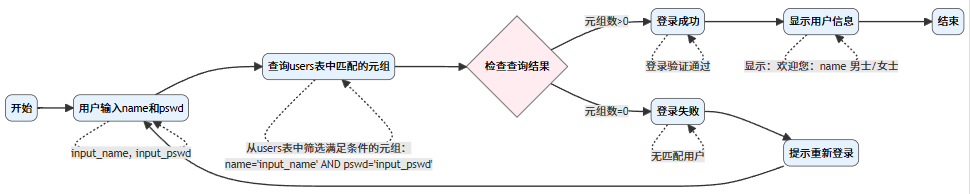

# Relational Model Homework

42227096 鄢怡然

---
---

## 题目一（3分+4分）
考虑一个`银行`数据库，其关系模式如下所示：

- branch (branch_name, branch_city, assets)
- customer (ID, customer_name, customer_street, customer_city)
- loan (loan_number, branch_name, amount)
- borrower (ID, loan_number)
- account (account_number, branch_name, balance)
- depositor (ID, account_number)

使用`关系代数`完成下面的查询：

1. 找到位于`成都`市的支行的名字。

$$\Pi_{branch\_name}(\sigma_{branch\_city='成都'}(branch))$$

2. 找到在`杨柳`支行有贷款（`loan`）的借款人（`borrower`）的ID。

$$\Pi_{ID}(\sigma_{branch\_name='杨柳支行'}(loan)\bowtie borrower)$$

---

## 题目二（3分）
假设数据库中存储用户名和密码的关系模式是 users(name, pswd, gender)，请结合关系代数简述实现`用户登录`逻辑的思路。

根据给出的关系模式`users(name, pswd, gender)`，可知实现`用户登录`的逻辑思路为：

1. 用户输入`name`和`pswd`，假设为`input_name`,`input_pswd`
2. 系统通过操作$\sigma$从`users`关系中筛选满足条件的元组：$$\sigma_{name='input\_name'\land pswd='input\_pswd'}(users)$$
3. 检查筛选元组：
   - 若返回元组数大于0，则登录成功
   - 返回元组数为0，无匹配用户，失败，提示重新登录，返回 步1
4. 登录成功后可以进一步显示用户信息`gender`：$$\Pi_{gender}(\sigma_{name='input\_name'\land pswd='input\_pswd'}(users)$$
   - 页面显示：“欢迎您：name 男士/女士 ”

