# Lab_SQL Homework
<p align = 'right'>42227096 鄢怡然</p>

---
---

## 题目一（3分+1分）

> **需要**使用PostgreSQL/MySQL及DataGrip软件操作，并对操作页面及结果进行截图。

1. 新建一个`university`数据库，并执行`largeRelationsInsertFile.sql`，导入数据。

   - 新建一个`university`数据库
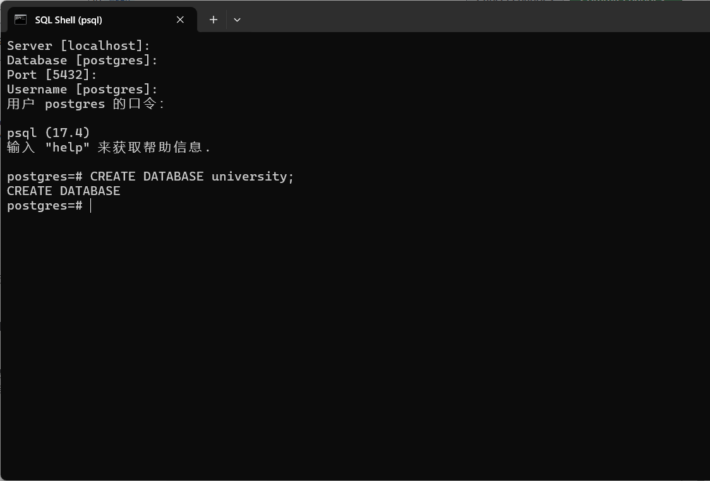
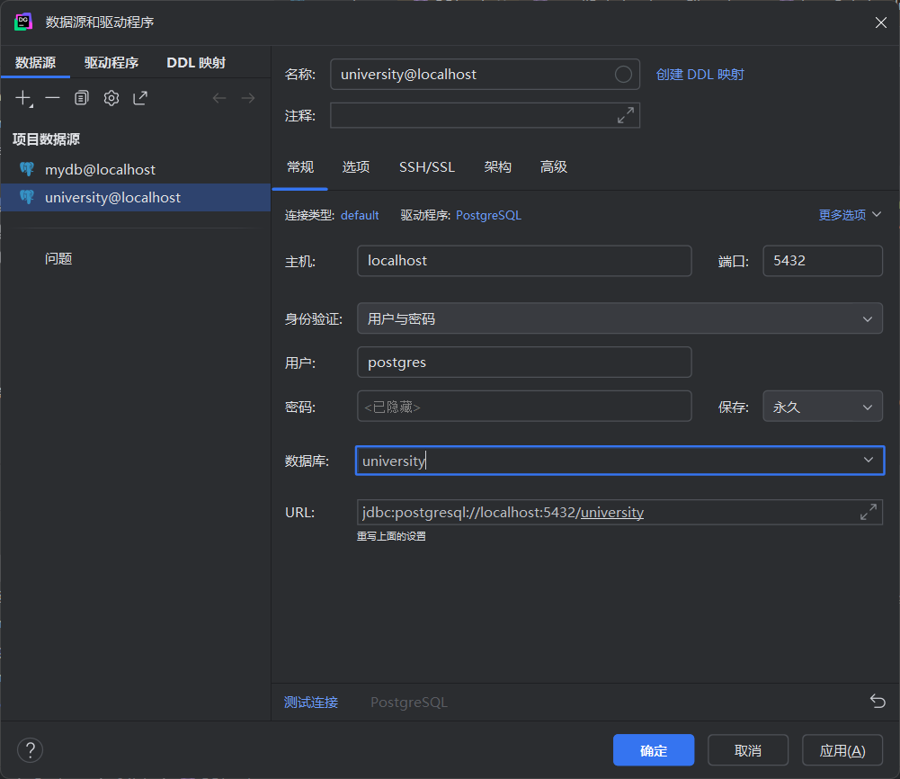
   - 执行`largeRelationsInsertFile.sql`，导入数据
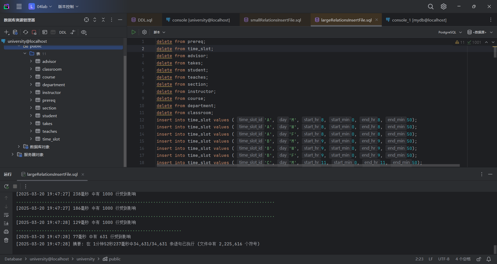

    **完成**

2. 运行第2次作业的题目三代码。注意：把原题目中的`会计`改成`History`。

```sql
SELECT DISTINCT T.name
FROM instructor AS T, instructor AS S
WHERE T.salary > S.salary AND S.dept_name = 'History';
```

- 表示找到所有**薪资比历史学院`至少一位`教师工资高的教师姓名**。
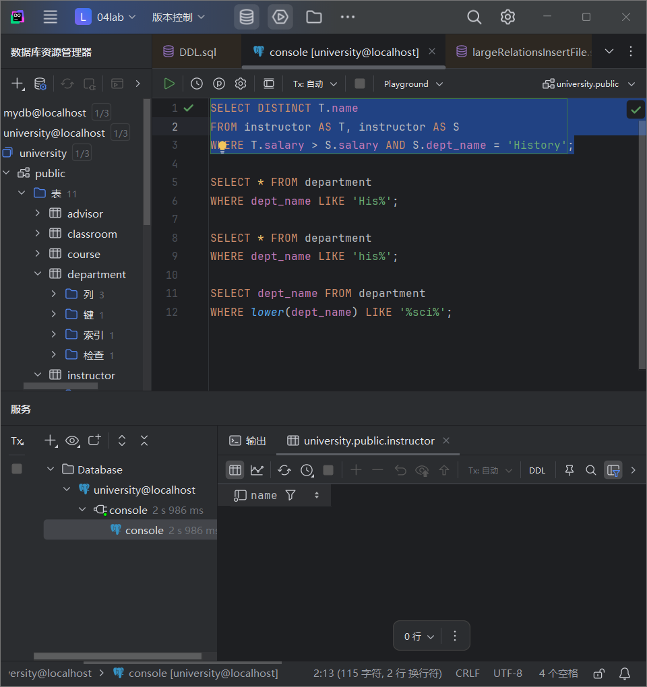
结果为**无**。

---

## 题目二（3分）

### PostgreSQL

参考[Pattern Matching](https://www.postgresql.org/docs/17/functions-matching.html)，在PG中使用至少三种方法实现找到所有以`S`开头教师的名字。
1. LIKE
```sql
SELECT name FROM instructor
WHERE name LIKE 'S%';
```
- 查询结果
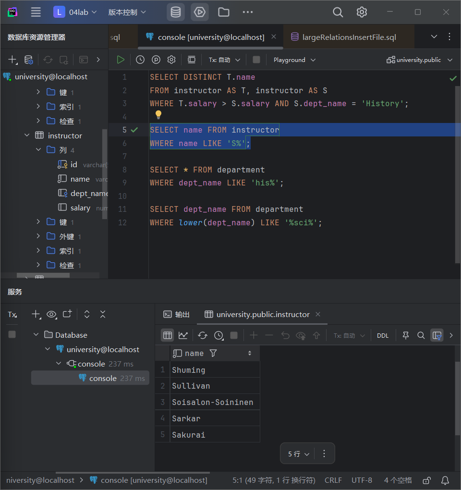

2. SIMILAR TO
```sql
SELECT name FROM instructor
WHERE name SIMILAR TO 'S%';
```
- 查询结果
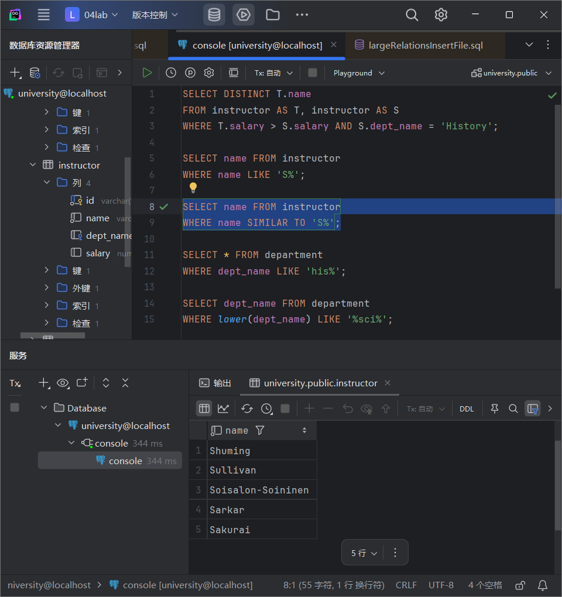

3. POSIX Regular Expressions
```sql
SELECT name FROM instructor
WHERE name ~ '^S';
```
- 查询结果
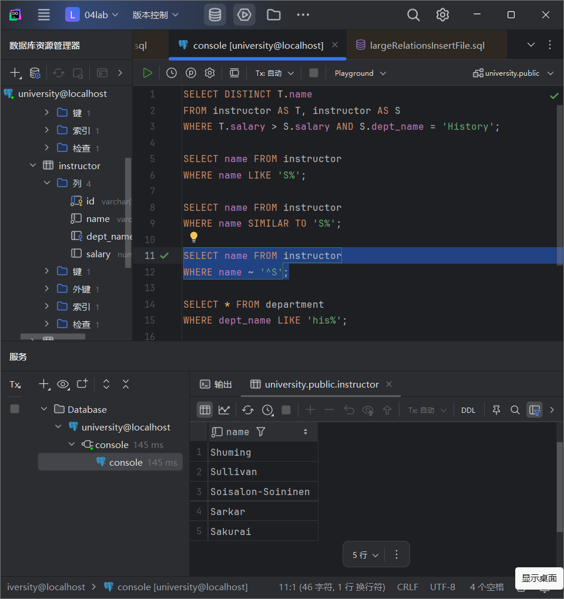

---

## 题目三（3分）

`psql`是PostgreSQL的命令行工具，请使用`psql`命令行工具：

1. 实现题目二
连接数据库`university`

执行**题目二**查询语句，查询及结果如下：
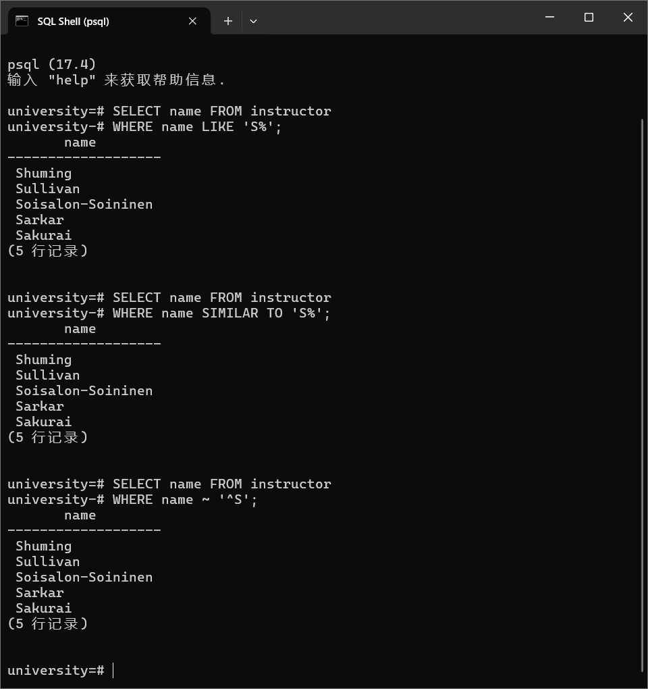

2. 列出所有的数据库
使用`\l`命令
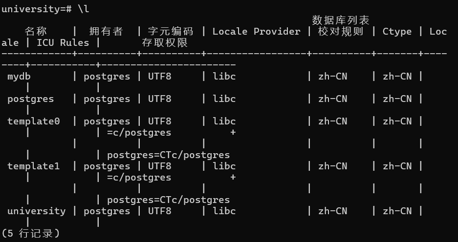

3. 列出当前数据库的所有表
以数据库`university`为例，使用`\d`命令
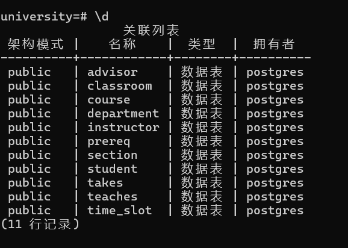

4. 显示某张表的关系模式
以数据库`university`下的`instructor`为例，使用`\d instructor`命令
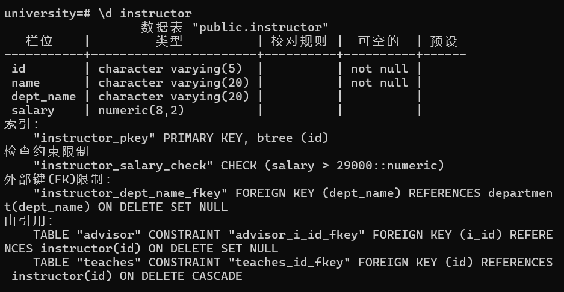

Hint: [psql](https://www.postgresql.org/docs/current/app-psql.html), [mysql shell](https://dev.mysql.com/doc/mysql-shell/8.0/en/mysql-shell-commands.html)
