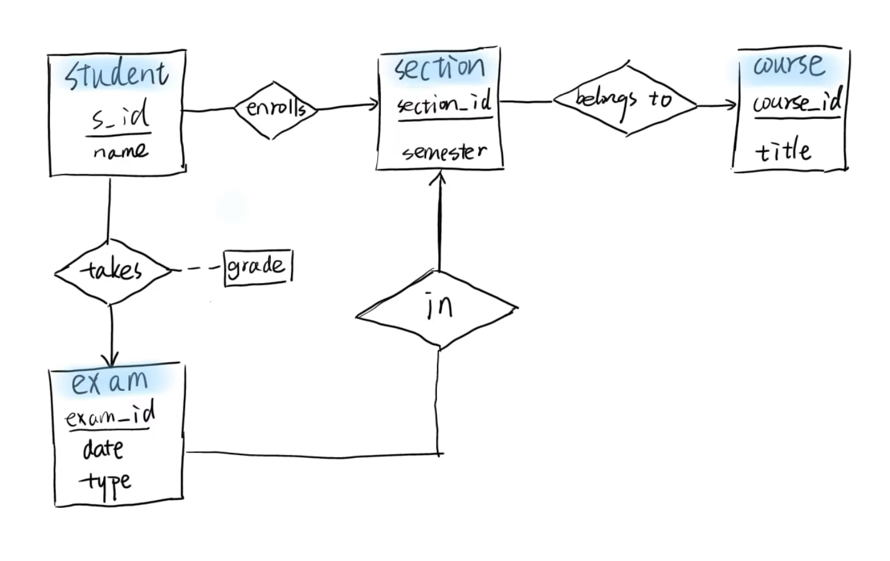
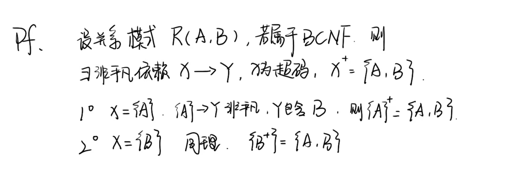

# ER Homework

<p align='right'>42227096 鄢怡然</p>

> 题目一：考虑一个用于记录学生（student）在不同课程段（section）在不同考试中取得成绩（grade）的数据库，其中课程段属于某个课程（course）。
> 1. 绘制E-R图，只用二元联系。确保能够表示一个学生在不同考试中获得的成绩，且一个课程段可能有多次考试。（提示：使用多值属性）

- 实体集
student
course
section
exam

- 联系集
student-**enrolls**-section
section-**belongsto**-course
exam-**in**-section
student-**takes**-exam



> 2. 写出上面E-R图的关系模式（要求注明主码）。

```sql
- student(s_id PRIMARY KEY, name)
- course(course_id PRIMARY KEY, title)
- section(section_id PRIMARY KEY, semester, course_id FOREIGN KEY REFERENCES Course(course_id))
- exam(exam_id PRIMARY KEY, date, type, section_id FOREIGN KEY REFERENCES section(section_id))

- enrolls(s_id FOREIGN KEY REFERENCES student(s_id),
    section_id FOREIGN KEY REFERENCES section(section_id),
    PRIMARY KEY (s_id, section_id))
- takes(
    s_id FOREIGN KEY REFERENCES student(s_id),
    exam_id FOREIGN KEY REFERENCES exam(exam_id),
    grade,
    PRIMARY KEY (s_id, exam_id))
- belongsto(
    section_id FOREIGN KEY REFERENCES section(section_id),
    course_id  FOREIGN KEY REFERENCES course(course_id),
    PRIMARY KEY (section_id)
  )
- In(
    exam_id FOREIGN KEY REFERENCES exam(exam_id),
    section_id FOREIGN KEY REFERENCES section(section_id),
    PRIMARY KEY (exam_id)
  )
```

---

> 题目二：如果一个关系模式中只有两个属性，证明该关系模式必定属于BCNF。



---

> 题目三：考虑关系模式`r(A, B, C, D, E)`，有如下函数依赖：
> - A → BC
> - BC → E
> - CD → AB
> 请给出一个满足BCNF的分解，并说明你的分解符合BCNF。

由题，CD是候选码。分解：
- R1(A, B, C)：A → BC，满足BCNF
- R2(A, D, E)：无函数依赖，满足BCNF
- R3(B, C, E)：BC → E，满足BCNF

> 每个依赖的左边在其所在子关系中为超码，所有依赖被保留。
