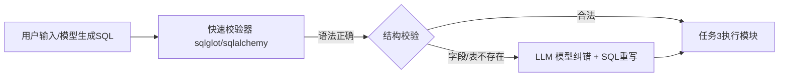

# 任务2

> 快速识别验证 + LLM 提示 `智能体`
> 接受：任务1的错误sql语句
> 输出：错误报告——友好提示，修改建议

> - 用`传统工具`快速筛选“语法错误”和“结构合法性”
> - 用`LLM`修复字段名错误、自动重写语句、生成自然语言解释
> - 保持`prompt/schema/结果`格式一致，便于整个链路的数据流通

---

## 1. 用户输入文字，已经转成sql语句，输入agent

## 2. 快速校验器

1. 执行脚本
    - 使用 EXPLAIN 检查 SQL 是否在 PostgreSQL 下合法。
    - 连接配置使用环境变量（方便在 Render 设置）。
    - 接口路径 /validate，接收 JSON 格式输入。
2. 内置project2025关系模式
    - 定义了 users 和 orders 表，用于模拟 SQL 验证上下文。
    - Render 的数据库会手动导入一次即可，不自动执行此文件。
3. render部署（yaml配置文件）
    - 自动将 Render 的 PostgreSQL 数据库绑定到环境变量。
    - 启动时使用 uvicorn 执行 FastAPI 应用。

## 3. LLM 模型纠错

## 4. 接口集成

## 5. 使用文档（可能要）